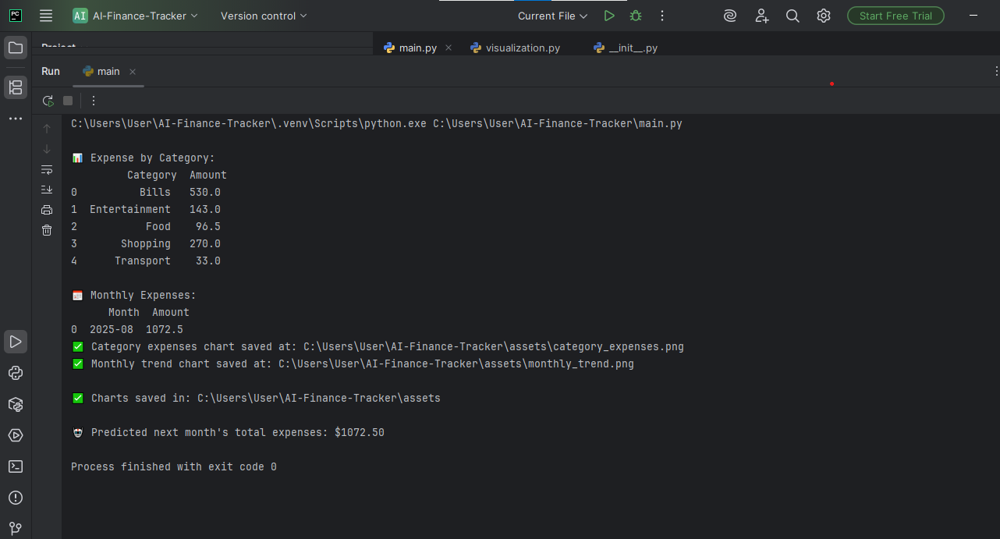

# AI Finance Tracker 💰📊


> An **AI-powered personal finance tracker** that helps you analyze expenses, visualize spending trends, and predict future financial outcomes.

---

## 📸 Project Output
Here’s a sample run of the project with generated charts and AI prediction:




---

## ✨ Features
✅ Expense tracking by category  
✅ Monthly financial summaries  
✅ Data visualizations (charts & trends)  
✅ AI-powered future expense prediction  
✅ Export results to CSV & PNG  

---

## ⚙️ Tech Stack
- **Python 3.10+**
- **Pandas** → for data handling  
- **Matplotlib** → for charts & visualization  
- **Scikit-learn (Linear Regression)** → for prediction  

---

## 🚀 Getting Started

### 1️⃣ Clone the repository
```bash
git clone https://github.com/uzainmohid/AI-Finance-Tracker.git
cd AI-Finance-Tracker

2️⃣ Install dependencies
pip install -r requirements.txt

3️⃣ Run the project
python finance_tracker.py

📂 Project Structure
AI-Finance-Tracker/
│── assets/                # Saved charts & screenshots
│   ├── category_expenses.png
│   ├── monthly_trend.png
│   └── AI_Finance_Results.png
│── finance_data.csv       # Sample finance data
│── finance_tracker.py     # Main project file
│── requirements.txt       # Python dependencies
│── README.md              # Project documentation

🌍 Real-World Use Case

This project is a mini personal finance assistant. It can be extended into:

💳 Budgeting apps

📊 Financial dashboards

🤖 AI expense management platforms

📌 Author

👨‍💻 Uzain Mohid
📧 uzainmohid@gmail.com

🔗 LinkedIn
 | GitHub
